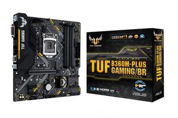
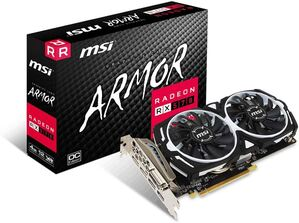
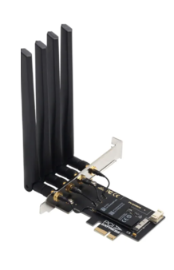
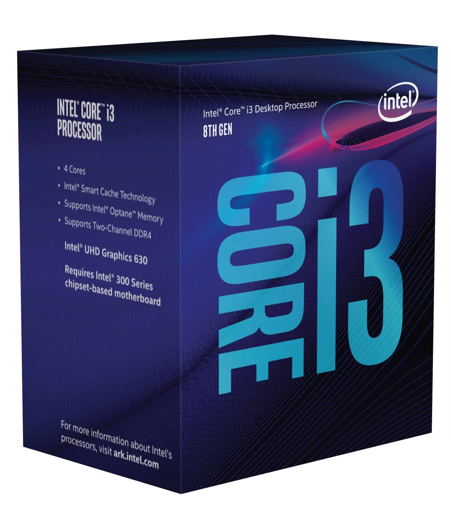

# EFI Hackintosh ASUS TUF B360M-PLUS GAMING/BR motherboard
Desempenho considerável, funcionalidades 100%

<table>
  <tr align="center">
    <td></td>
    <td></td>
    <td></td>
    <td></td>
    <td></td>
  </tr>
  <tr align="left">
    <td><small>ASUS TUF B360M-PLUS GAMING/BR</small></td>
    <td>Placa de Vídeo - RX 570 4GB ARMOR MSI</td>
    <td>Placa de Rede bcm94360 de 1750mbps, bluetooth 4.0</td>
    <td>Processor Intel Core i3-8100</td>
    <td>2x Memoria Desktop DDR4 4GB</td>
  </tr>
</table>

## 📝 Funcionalidades
Versões do sistema Mac OS e todas suas funcionalidade e versões
<table>
  <tr>
    <td rowspan="2"></td>
    <th colspan="2">Mac OS Catalina 10.15.7</th>
  </tr>
  <tr>
    <td>
      ✅ 🎙️Audio  
      ✅ 🖥️ Graphics  
      ✅ 🌐 Ethernet  
      ✅ 🛜 wifi  
    </td>

  </tr>
  <tr>
    <td rowspan="2"></td>
    <th colspan="2">Mac OS Ventura 13.6.6</th>
  </tr>
  <tr>
    <td>
      ✅ 🎙️Audio  
      ✅ 🖥️ Graphics  
      ✅ 🌐 Ethernet  
      ✅ 🛜 wifi  
    </td>

  </tr>
</table>

## 🤝 Creditos

+ Mac OS ISO: [Olarila](https://www.olarila.com/topic/6278-olarila-vanilla-images-macos-installer/)
+ EFI Ventura: https://github.com/ZzzM/Hackintosh-MSI-B360M-MORTAR
+ Motherboard Manual: [PLUS_GAMING_BR_UM_manual](./assets/E14070_TUF_B360M-PLUS_GAMING_BR_UM_manual.pdf)

